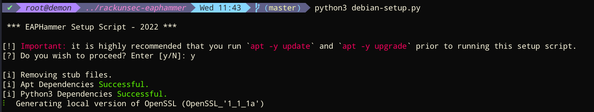

# RackunSec-EapHammer
This repository is a fork of [s0lst1c3's EAPHammer]() with a few adjustments made.

## Compile EAPHammer Dependencies
The setup and build process will install to a local directory (not system-wide). This fork of EAPHammer is designed specifically for Debian-based distributions (e.g.: Debian, Demon Linux, Kali Linux, etc)
```bash
apt update
apt upgrade
git clone https://github.com/RackunSec/rackunsec-eaphammer.git
cd rackunsec-eaphammer
python3 -m pip install -r requirements.txt
python3 debian-setup.py
```

## Run EAPHammer
Once completed, you can run EAPHammer from the directory:
```bash
python3 eaphammer --cert-wizard
python3 eaphammer (args)
```
---


by Gabriel Ryan ([s0lst1c3](https://twitter.com/s0lst1c3))(gabriel[at]solstice|d0t|sh)


